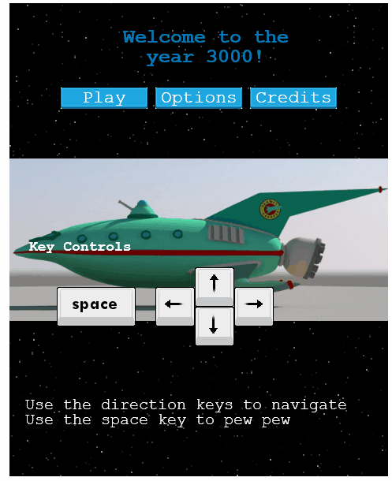

# Gamer-ama

 

  

  <h3 align="center">Gamerama</h3>

  

    A 2D Game.
     
    <a href="https://docs.google.com/document/d/1-zNJmz-6qaaU-A0K27EK4gqOucXgGByr81MkmnZPCzI/edit?usp=sharing"><strong>Game Design Documentation »</strong></a>
     
     
    <a href="hhttps://github.com/simandebvu/gamer-rama/issues/">Report Bug</a>
    ·
    <a href="https://github.com/simandebvu/gamer-rama/">Request Feature</a>
  

> In this project, I build a space themed shooter game using JavaScript's framework Phaser 3, a "fast, free and fun open-source framework for Canvas and WebGL powered browser games".

## Table Of Contents

- [Gamer-ama](#gamer-ama)
  - [Table Of Contents](#table-of-contents)
  - [Built With](#built-with)
  - [About the game](#about-the-game)
  - [How to play](#how-to-play)
  - [Game Design Document](#game-design-document)
  - [Live Demo](#live-demo)
  - [Local Installation](#local-installation)
  - [Automated Test](#automated-test)
  - [Potential future features](#potential-future-features)
  - [Authors](#authors)
  - [🤝 Contributing](#-contributing)
  - [Show your support](#show-your-support)
  - [Acknowledgments](#acknowledgments)
  - [📝 License](#-license)

## Built With

- Javascript
- Node
- Webpack
- Bootstrap
- VSCode
- JSHint
- Github Actions
- Phaser 3
- ES6
- Jest
- Microverse Leaderboard API Service

## About the game 

The games’ based on futurama. Futurama is an American adult animated science fiction sitcom created by Matt Groening that aired on Fox from March 28, 1999 to August 10, 2003 and on Comedy Central from March 23, 2008 to September 4, 2013.

Enemies appear at the top of the canvas Some shoot you, some pass straight, some pursue you. You control the ship with keyboard arrows while you shoot with the spacebar. Just destroy as many enemies as you can before your HP runs out and you die.

In the end, you can add your name to our Leader Board and check the high scores.
The player will be part of the planet express crew in a bid to deliver precious cargo amidst space battle. 

## How to play

- Use arrow keys to navigate the ship
- Use the Space Bar to shoot

## Game Design Document

Feel free to look at it, by clicking [here.](https://docs.google.com/document/d/1-zNJmz-6qaaU-A0K27EK4gqOucXgGByr81MkmnZPCzI/edit?usp=sharing)
  
## Live Demo

[Live Demo Link](https://simandebvu.github.io/tic-tac-toe-javascript/)

## Local Installation 

- Click on the green button "Clone or Download"
- Click on Download ZIP
- Extract the game
- In your terminal, navigate to the game's folder
- Install dependencies:

`$ npm install`

- Start the local webserver:

`$ npm start` > will open a local webserver at http://localhost:8080/ directly in your default browser with the game ready to be played

## Automated Test
Run the command and see the output: `$ npm run test`

## Potential future features

- Extend the game to a multiplayer online game
- Port it to mobile
- Make a WEBXR variant

## Authors

👤 **Shingirayi Mandebvu**

- Github: [@simandebvu](https://github.com/simandebvu)
- Twitter: [@simandebvu](https://twitter.com/simandebvu)
- Linkedin: [linkedin](https://linkedin.com/in/simandebvu)

## 🤝 Contributing

Contributions, issues and feature requests are welcome!

Feel free to check the [issues page](issues/).

## Show your support

Give a ⭐️ if you like this project!

## Acknowledgments

- Microverse
- Song : In the Year 2525 (Exordium & Terminus) by Zager & Evans
- Futurama 
- [Jared York](https://learn.yorkcs.com/)

## 📝 License

This project is [MIT](lic.url) licensed.
